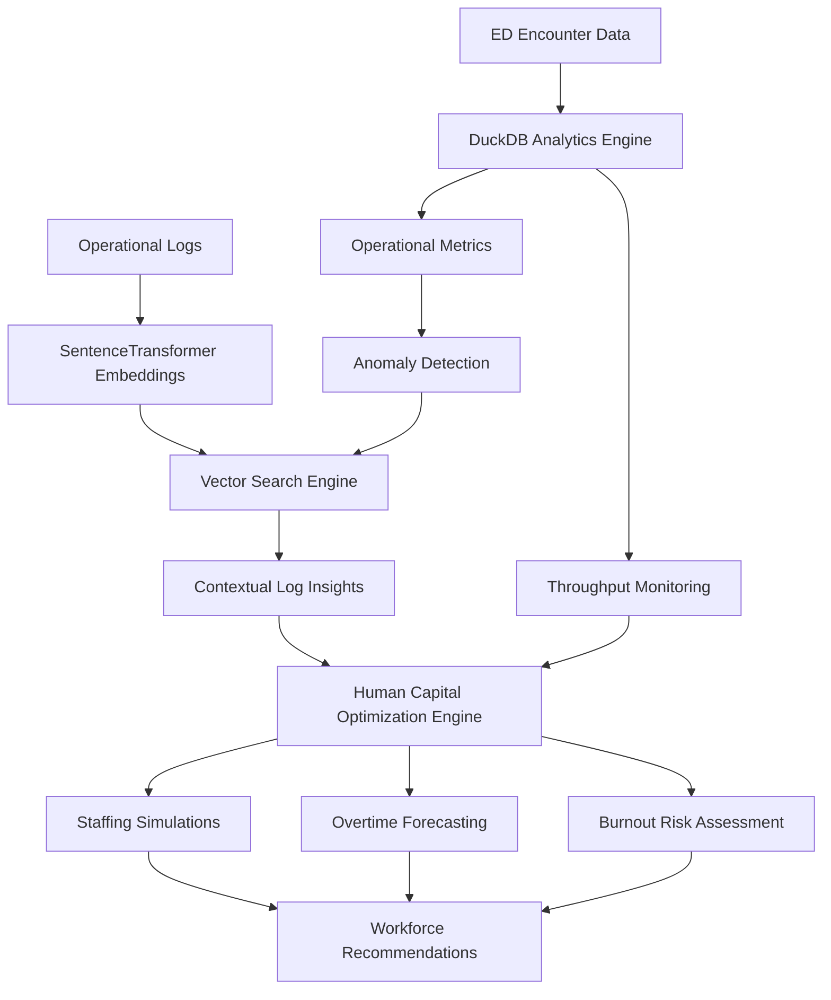

# Healthcare Workforce Optimization Platform

## Overview

The Healthcare Workforce Optimization Platform is an analytics system designed to connect emergency department (ED) operational performance with workforce planning decisions. By combining structured encounter data, semantic analysis of operational logs, and staffing optimization models, the platform helps healthcare organizations identify throughput bottlenecks, evaluate staffing interventions, and reduce overtime-related burnout.

---

## Data Schema Specification

The relational analytical core utilizes an optimized column-oriented structure within DuckDB to store operational emergency encounter metrics.

### Table: `ed_encounters`

| Column Name | Data Type | Constraint / Format | Description |
|------------|-----------|---------------------|-------------|
| `encounter_id` | INTEGER | Primary Key | Unique token identifying a specific clinical event |
| `hour` | INTEGER | Range: 0–23 | Hour of day when the operational encounter occurred |
| `disposition` | VARCHAR | Floor, ICU, Discharged | Target departmental placement of the patient |
| `avg_los_minutes` | DOUBLE | Non-negative | Continuous rolling tracking of total patient length of stay |
| `total_patients` | INTEGER | Non-negative | Cumulative head-count metrics within the tracking window |
| `avg_volume` | DOUBLE | Non-negative | Long-term tracking mean baseline for arrival volumes |
| `peak_volume` | DOUBLE | Non-negative | Maximum volume upper-bound recorded within that slice |

---

## Core Analytical Architecture

The repository implements a synchronized data pipeline designed to link clinical throughput metrics directly with workforce optimization strategies.

### 1. Self-Healing Relational Query Pipeline

**Engine:** DuckDB In-Memory OLAP Data Store

#### Purpose

The system extracts temporal and categorical insights directly from active transactional schemas such as `ed_encounters`.

#### Features

- High-performance analytical querying
- Dynamic schema discovery
- Runtime table validation
- Automated fallback query generation
- Resilience against schema drift and container migration events

#### Self-Healing Layer

The self-healing architecture (implemented in `src/compiler.py`) prevents system failures by dynamically interrogating database schemas through active connection streams and adapting query execution when expected columns or tables change.

---

### 2. Contextual Log Auditing

**Engine:** Vector Semantic Search using Sentence Transformers

**Model:** `all-MiniLM-L6-v2`

#### Purpose

Identifies operational bottlenecks by correlating quantitative anomalies with unstructured operational documentation.

#### Capabilities

- Semantic similarity search
- Operational incident retrieval
- Severity-based note classification
- Institutional knowledge mapping
- Root-cause exploration for throughput disruptions

#### Workflow

1. Operational metrics trigger anomaly detection.
2. Relevant log entries are embedded into vector space.
3. Semantic search retrieves contextually similar incidents.
4. Results are surfaced alongside quantitative metrics for investigation.

---

### 3. Human Capital Optimization Engine

#### Purpose

Evaluates staffing interventions by balancing labor costs against overtime reduction and workforce sustainability.

#### Variables Considered

- Baseline nursing rates
- Overtime wage multipliers
- Fixed onboarding costs
- Float pool staffing additions
- Shift capacity constraints

#### Mathematical Model

The system computes average overtime burden per employee using:

$$
\text{Average Overtime Per Head} =
\frac{\max(0,\;T_{\text{overtime}} - 8N_{\text{float}})}
{C_{\text{crew}}}
$$

Where:

| Variable | Description |
|-----------|-------------|
| $T_{\text{overtime}}$ | Total collective overtime hours |
| $N_{\text{float}}$ | Simulated float staff additions |
| $C_{\text{crew}}$ | Baseline shift staffing capacity (default = 4.0) |

#### Optimization Logic

The engine:

- Estimates shift-level overtime reduction
- Measures employee fatigue exposure
- Flags staffing risk scenarios
- Evaluates intervention ROI
- Identifies diminishing-return thresholds

#### Burnout Risk Threshold

The system generates workforce alerts when:

$$
\text{Average Overtime Per Head} \geq 4.0
$$

This threshold represents elevated burnout risk and triggers staffing recommendations.

---

## System Architecture

---

## Technology Stack

### Data Layer

- DuckDB
- SQL

### Analytics Layer

- Python
- Pandas
- NumPy

### NLP & Semantic Search

- SentenceTransformers
- all-MiniLM-L6-v2
- Vector Similarity Search

### Optimization Layer

- Workforce Cost Modeling
- Staffing Simulation Engine
- Overtime Forecasting Framework

---

## Key Capabilities

- Clinical throughput monitoring
- Operational anomaly detection
- Semantic log auditing
- Staffing optimization
- Overtime forecasting
- Burnout risk identification
- Cost-benefit workforce analysis
- Self-healing query execution

---

## Example Use Case

A hospital administrator observes increased patient length-of-stay and rising overtime costs during evening shifts.

The platform:

1. Detects abnormal throughput metrics from ED encounter data.
2. Retrieves semantically related operational notes from historical logs.
3. Identifies recurring staffing shortages during peak volume periods.
4. Simulates float nurse staffing interventions.
5. Quantifies overtime reduction and labor cost tradeoffs.
6. Recommends the optimal staffing strategy while minimizing burnout risk.

---
